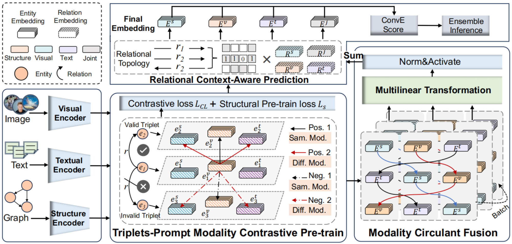

# Multimodal Contextual Interactions of Entities: A Modality Circular Fusion Approach for Link Prediction

## Overview
<p align="center">
  
</p>

## Requirments
- Python==3.8
- numpy==1.24.3
- pillow==10.2.0
- torch==1.13.0
- tqdm==4.66.1
- wheel==0.41.2

## Code Structure
The code is organized as follows:
```text
├── datasets
│   ├── DB15K
│   ├── MKG-W
│   └── MKG-Y
│   └── VTJG-I
│   └── VTKG-C
│   └── WN18RR++
│   └── YAGO15K
├── layers
│   ├── __init__
│   └── layer
├── models
│   ├── __init__
│   └── model
├── utils
│   ├── __init__
│   ├── data_loader
│   └── data_util
├── Readme.md
└── main.py
```

### Main Result
**YAGO15K Dataset**
<details>
  <summary>Details</summary>
  <table>
    <tr><th>Model</th><th>MRR</th><th>H@1</th><th>H@3</th><th>H@10</th></tr>
    <tr><td>TransE</td><td>0.1610</td><td>0.0510</td><td>-</td><td>0.3840</td></tr>
    <tr><td>ConvE</td><td>0.2670</td><td>0.1680</td><td>-</td><td>0.4260</td></tr>
    <tr><td>TuckER</td><td>0.2810</td><td>0.1830</td><td>-</td><td>0.4570</td></tr>
    <tr><td>IKRL</td><td>0.1390</td><td>0.0480</td><td>-</td><td>0.3170</td></tr>
    <tr><td>MKGC</td><td>0.1290</td><td>0.0410</td><td>-</td><td>0.2970</td></tr>
    <tr><td>MKBE</td><td>0.2730</td><td>0.1750</td><td>-</td><td>0.4230</td></tr>
    <tr><td>IMF</td><td>0.3120</td><td>0.2339</td><td>0.3432</td><td>0.4617</td></tr>
    <tr><td>MANS</td><td>-</td><td>-</td><td>-</td><td>-</td></tr>
    <tr><td>AdaMF-MAT</td><td>-</td><td>-</td><td>-</td><td>-</td></tr>
    <tr><td>our (w/o MCF)</td><td>0.3594</td><td>0.2931</td><td>0.3925</td><td>0.4874</td></tr>
    <tr><td>our (w/o PCL)</td><td>0.4189</td><td>0.3560</td><td>0.4508</td><td>0.5341</td></tr>
    <tr><td>our (w/o AggRC)</td><td>0.4244</td><td>0.3602</td><td>0.4560</td><td>0.5438</td></tr>
    <tr><td>our</td><td>0.4303</td><td>0.3688</td><td>0.4617</td><td>0.5449</td></tr>
  </table>
</details>

**DB15K Dataset**
<details>
  <summary>Details</summary>
  <table>
    <tr><th>Model</th><th>MRR</th><th>H@1</th><th>H@3</th><th>H@10</th></tr>
    <tr><td>TransE</td><td>0.2560</td><td>0.1370</td><td>-</td><td>0.4690</td></tr>
    <tr><td>ConvE</td><td>0.3120</td><td>0.2190</td><td>-</td><td>0.5070</td></tr>
    <tr><td>TuckER</td><td>0.3410</td><td>0.2430</td><td>-</td><td>0.5380</td></tr>
    <tr><td>IKRL</td><td>0.2220</td><td>0.1110</td><td>-</td><td>0.4260</td></tr>
    <tr><td>MKGC</td><td>0.2080</td><td>0.1080</td><td>-</td><td>0.4190</td></tr>
    <tr><td>MKBE</td><td>0.3320</td><td>0.2350</td><td>-</td><td>0.5130</td></tr>
    <tr><td>IMF</td><td>0.4410</td><td>0.3784</td><td>0.4721</td><td>0.5618</td></tr>
    <tr><td>MANS</td><td>0.3320</td><td>0.2040</td><td>0.4200</td><td>0.5500</td></tr>
    <tr><td>AdaMF-MAT</td><td>0.3514</td><td>0.2530</td><td>0.4111</td><td>0.5292</td></tr>
    <tr><td>our (w/o MCF)</td><td>0.4227</td><td>0.3614</td><td>0.4517</td><td>0.5384</td></tr>
    <tr><td>our (w/o PCL)</td><td>0.4578</td><td>0.3911</td><td>0.4890</td><td>0.5865</td></tr>
    <tr><td>our (w/o AggRC)</td><td>0.4612</td><td>0.3959</td><td>0.4909</td><td>0.5871</td></tr>
    <tr><td>our</td><td>0.4621</td><td>0.3977</td><td>0.4935</td><td>0.5889</td></tr>
  </table>
</details>

**MKG-Y Dataset**
<details>
  <summary>Details</summary>
  <table>
    <tr><th>Model</th><th>MRR</th><th>H@1</th><th>H@3</th><th>H@10</th></tr>
    <tr><td>GC-OTE</td><td>0.3295</td><td>0.2677</td><td>0.3644</td><td>0.4408</td></tr>
    <tr><td>IKRL</td><td>0.3322</td><td>0.3037</td><td>0.3428</td><td>0.3826</td></tr>
    <tr><td>TBKGC</td><td>0.3399</td><td>0.3047</td><td>0.3527</td><td>0.4007</td></tr>
    <tr><td>MMKRL</td><td>0.3681</td><td>0.3166</td><td>0.3979</td><td>0.4531</td></tr>
    <tr><td>RSME</td><td>0.3444</td><td>0.3178</td><td>0.3607</td><td>0.3909</td></tr>
    <tr><td>OTKGE</td><td>0.3551</td><td>0.3197</td><td>0.3718</td><td>0.4138</td></tr>
    <tr><td>KBGAN</td><td>0.2971</td><td>0.2281</td><td>0.3488</td><td>0.4021</td></tr>
    <tr><td>MANS</td><td>0.2903</td><td>0.2525</td><td>0.3135</td><td>0.3449</td></tr>
    <tr><td>MMRNS</td><td>0.3593</td><td>0.3053</td><td>0.3907</td><td>0.4547</td></tr>
    <tr><td>IMF</td><td>0.3580</td><td>0.3300</td><td>0.3710</td><td>0.4060</td></tr>
    <tr><td>our (w/o MCF)</td><td>0.3546</td><td>0.3162</td><td>0.3763</td><td>0.4204</td></tr>
    <tr><td>our (w/o PCL)</td><td>0.3761</td><td>0.3481</td><td>0.3903</td><td>0.4288</td></tr>
    <tr><td>our (w/o AggRC)</td><td>0.3796</td><td>0.3494</td><td>0.3960</td><td>0.4367</td></tr>
    <tr><td>our</td><td>0.3887</td><td>0.3562</td><td>0.4041</td><td>0.4495</td></tr>
  </table>
</details>

**MKG-W Dataset**
<details>
  <summary>Details</summary>
  <table>
    <tr><th>Model</th><th>MRR</th><th>H@1</th><th>H@3</th><th>H@10</th></tr>
    <tr><td>GC-OTE</td><td>0.3392</td><td>0.2655</td><td>0.3596</td><td>0.4605</td></tr>
    <tr><td>IKRL</td><td>0.3236</td><td>0.2611</td><td>0.3475</td><td>0.4407</td></tr>
    <tr><td>TBKGC</td><td>0.3148</td><td>0.2531</td><td>0.3398</td><td>0.4324</td></tr>
    <tr><td>MMKRL</td><td>0.3010</td><td>0.2216</td><td>0.3409</td><td>0.4469</td></tr>
    <tr><td>RSME</td><td>0.2923</td><td>0.2336</td><td>0.3197</td><td>0.4043</td></tr>
    <tr><td>OTKGE</td><td>0.3466</td><td>0.2885</td><td>0.3625</td><td>0.4488</td></tr>
    <tr><td>KBGAN</td><td>0.2947</td><td>0.2221</td><td>0.3487</td><td>0.4064</td></tr>
    <tr><td>MANS</td><td>0.3088</td><td>0.2489</td><td>0.3363</td><td>0.4178</td></tr>
    <tr><td>MMRNS</td><td>0.3413</td><td>0.2737</td><td>0.3748</td><td>0.4682</td></tr>
    <tr><td>IMF</td><td>0.3450</td><td>0.2880</td><td>0.3660</td><td>0.4540</td></tr>
    <tr><td>our (w/o MCF)</td><td>0.3151</td><td>0.2536</td><td>0.3416</td><td>0.4269</td></tr>
    <tr><td>our (w/o PCL)</td><td>0.3342</td><td>0.2846</td><td>0.3547</td><td>0.4314</td></tr>
    <tr><td>our (w/o AggRC)</td><td>0.3440</td><td>0.2912</td><td>0.3673</td><td>0.4438</td></tr>
    <tr><td>our</td><td>0.3581</td><td>0.3074</td><td>0.3801</td><td>0.4593</td></tr>
  </table>
</details>

**VTKG-I Dataset**
<details>
  <summary>Details</summary>
  <table>
    <tr><th>Model</th><th>MRR</th><th>H@1</th><th>H@3</th><th>H@10</th></tr>
    <tr><td>ANALOGY</td><td>0.3040</td><td>0.2328</td><td>0.3015</td><td>0.4466</td></tr>
    <tr><td>ComplEx-N3</td><td>0.3911</td><td>0.3168</td><td>0.4046</td><td>0.5191</td></tr>
    <tr><td>RotateE</td><td>0.3131</td><td>0.2099</td><td>0.3473</td><td>0.5267</td></tr>
    <tr><td>PairRE</td><td>0.4104</td><td>0.3015</td><td>0.4504</td><td>0.6145</td></tr>
    <tr><td>RSME</td><td>0.4027</td><td>0.3321</td><td>0.4122</td><td>0.5573</td></tr>
    <tr><td>TransAE</td><td>0.2437</td><td>0.0687</td><td>0.3092</td><td>0.6374</td></tr>
    <tr><td>OTKGE</td><td>0.4278</td><td>0.3588</td><td>0.4466</td><td>0.5458</td></tr>
    <tr><td>MoSE-AI</td><td>0.4306</td><td>0.3473</td><td>0.4466</td><td>0.6221</td></tr>
    <tr><td>IMF</td><td>0.4184</td><td>0.3282</td><td>0.456</td><td>0.5649</td></tr>
    <tr><td>our (w/o MCF)</td><td>0.3955</td><td>0.3206</td><td>0.4237</td><td>0.5382</td></tr>
    <tr><td>our (w/o PCL)</td><td>0.4615</td><td>0.3740</td><td>0.4733</td><td>0.6565</td></tr>
    <tr><td>our (w/o AggRC)</td><td>0.4709</td><td>0.3779</td><td>0.5052</td><td>0.6641</td></tr>
    <tr><td>our</td><td>0.4779</td><td>0.3969</td><td>0.5153</td><td>0.6718</td></tr>
  </table>
</details>

**VTKG-C Dataset**
<details>
  <summary>Details</summary>
  <table>
    <tr><th>Model</th><th>MRR</th><th>H@1</th><th>H@3</th><th>H@10</th></tr>
    <tr><td>ANALOGY</td><td>0.2963</td><td>0.2609</td><td>0.3180</td><td>0.3532</td></tr>
    <tr><td>ComplEx-N3</td><td>0.3944</td><td>0.3515</td><td>0.4079</td><td>0.4815</td></tr>
    <tr><td>RotateE</td><td>0.3893</td><td>0.3473</td><td>0.4062</td><td>0.4704</td></tr>
    <tr><td>PairRE</td><td>0.3876</td><td>0.3431</td><td>0.4013</td><td>0.4782</td></tr>
    <tr><td>RSME</td><td>0.3942</td><td>0.3513</td><td>0.4096</td><td>0.4776</td></tr>
    <tr><td>TransAE</td><td>0.0751</td><td>0.0053</td><td>0.1053</td><td>0.2072</td></tr>
    <tr><td>OTKGE</td><td>0.3939</td><td>0.3446</td><td>0.4152</td><td>0.4881</td></tr>
    <tr><td>MoSE-AI</td><td>0.3929</td><td>0.3186</td><td>0.4301</td><td>0.5210</td></tr>
    <tr><td>IMF</td><td>0.4116</td><td>0.3706</td><td>0.4261</td><td>0.4935</td></tr>
    <tr><td>our (w/o MCF)</td><td>0.3883</td><td>0.3522</td><td>0.4022</td><td>0.4586</td></tr>
    <tr><td>our (w/o PCL)</td><td>0.4148</td><td>0.3705</td><td>0.4297</td><td>0.5028</td></tr>
    <tr><td>our (w/o AggRC)</td><td>0.4186</td><td>0.3741</td><td>0.4335</td><td>0.5082</td></tr>
    <tr><td>our</td><td>0.4234</td><td>0.3770</td><td>0.4405</td><td>0.5169</td></tr>
  </table>
</details>

**WN18RR++ Dataset**
<details>
  <summary>Details</summary>
  <table>
    <tr><th>Model</th><th>MRR</th><th>H@1</th><th>H@3</th><th>H@10</th></tr>
    <tr><td>ANALOGY</td><td>0.4128</td><td>0.3969</td><td>0.4175</td><td>0.4438</td></tr>
    <tr><td>ComplEx-N3</td><td>0.4745</td><td>0.4292</td><td>0.4895</td><td>0.5675</td></tr>
    <tr><td>RotateE</td><td>0.4606</td><td>0.4274</td><td>0.4754</td><td>0.5230</td></tr>
    <tr><td>PairRE</td><td>0.4529</td><td>0.4127</td><td>0.4663</td><td>0.5351</td></tr>
    <tr><td>RSME</td><td>0.4567</td><td>0.4175</td><td>0.4751</td><td>0.5300</td></tr>
    <tr><td>TransAE</td><td>0.0900</td><td>0.0040</td><td>0.1291</td><td>0.2511</td></tr>
    <tr><td>OTKGE</td><td>0.4327</td><td>0.3722</td><td>0.4663</td><td>0.5407</td></tr>
    <tr><td>MoSE-AI</td><td>0.4857</td><td>0.4255</td><td>0.5094</td><td>0.5996</td></tr>
    <tr><td>IMF</td><td>0.4749</td><td>0.4397</td><td>0.4845</td><td>0.5469</td></tr>
    <tr><td>our (w/o MCF)</td><td>0.4620</td><td>0.4314</td><td>0.4750</td><td>0.5282</td></tr>
    <tr><td>our (w/o PCL)</td><td>0.5105</td><td>0.4561</td><td>0.5155</td><td>0.5949</td></tr>
    <tr><td>our (w/o AggRC)</td><td>0.5149</td><td>0.4687</td><td>0.5303</td><td>0.6112</td></tr>
    <tr><td>our</td><td>0.5169</td><td>0.5149</td><td>0.4687</td><td>0.6112</td></tr>
  </table>
</details>

## Usage
    
Model Training

    python main.py 